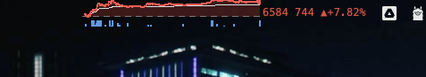

# StockBarks

Taiwan stock ticker for your macOS menu bar — discreet intraday line chart at a glance.

把台股即時走勢藏在 macOS menu bar，看起來像系統圖示，上班偷看不被發現。



## Features

- 即時報價（5 秒更新，自動依時段切換 5s/30s/60s）
- 分時折線圖（紅綠分段，以昨收為界）
- VWAP 均價線
- 按分鐘聚合成交量柱
- Menu bar 點開：開高低收、五檔、漲跌停、總成交量
- 自訂 watchlist，隨時切換股票
- 開盤自動 backfill 當日完整分時 K
- 隱蔽風格：menu bar 只看到一條小折線

## Requirements

- macOS（測過 26.5，理論支援 macOS 12+）
- [SwiftBar](https://github.com/swiftbar/SwiftBar)：`brew install --cask swiftbar`
- Python 3 + Pillow
- [Shioaji](https://sinotrade.github.io/zh/)：永豐金證券免費 API（需有永豐證券戶 + 申請 API key）

## Install

```bash
git clone https://github.com/jincocodev/stockbarks.git
cd stockbarks
bash install.sh
```

第一次裝完要做兩件事：

1. **設定 Shioaji 憑證**
   ```bash
   cp examples/sinotrade.env.example ~/.hermes/secrets/sinotrade.env
   vim ~/.hermes/secrets/sinotrade.env
   ```
   把你的 API key / secret / CA 密碼填進去。`Sinopac.pfx` 從永豐 e-leader 下載後放到 `~/.hermes/secrets/`。

2. **設定 SwiftBar Plugin Directory**
   開啟 SwiftBar → Preferences → Plugin Folder → 選 `~/.hermes/swiftbar/`

完成後重啟 daemon：
```bash
bash ~/.hermes/swiftbar/stockwatch_daemon_restart.sh
```

## Usage

- 點 menu bar 圖示看詳細資訊
- **Switch**：切換目前顯示的股票
- **Add**：加入新股票到 watchlist（輸入 4 碼代號，如 2330）
- **Remove**：從 watchlist 移除
- **Restart Daemon**：重啟背景抓資料行程
- **View Log**：開啟 daemon log

## Architecture

```
~/.hermes/swiftbar/
├── stockwatch.5s.py          # SwiftBar plugin（每 5 秒由 SwiftBar 執行，畫 menu bar）
├── stockwatch_daemon.py      # 背景 daemon（連 Shioaji，寫 JSON）
├── stockwatch_helper.py      # 切換/新增/移除 handler
├── stockwatch_daemon_restart.sh
├── stockwatch_state.json     # watchlist（runtime，不入 git）
├── stockwatch_data.json      # 即時 snapshot（runtime）
└── stockwatch_ticks.json     # 累積 tick（runtime）
```

Plugin 不直連 Shioaji——daemon 負責抓資料寫 JSON，plugin 只讀檔畫圖，避免 SwiftBar 5 秒一次重連把 API 打爆。

## Y 軸縮放

以「實際當日波動」為主，左右對稱（昨收居中），加 20% padding。低波動時最少顯示 ±0.5%，避免雜訊放大。

## Disclaimer 免責聲明

- 本工具僅供個人即時報價檢視，**非投資建議**
- Shioaji API 偶有延遲、斷線、資料異常，不保證即時準確
- 投資決策請自行負責
- 與永豐金證券無任何官方關係

## License

MIT — see [LICENSE](LICENSE)

## Credits

- [永豐金 Shioaji](https://sinotrade.github.io/zh/) — 免費台股 API
- [SwiftBar](https://github.com/swiftbar/SwiftBar) — macOS menu bar plugin platform
